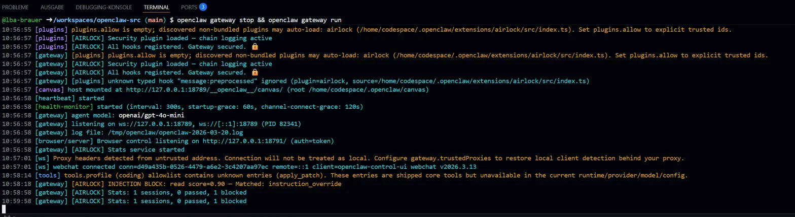

# 🔒 Airlock — OpenClaw Security Plugin

**Drop-in security layer for OpenClaw agents.**  
Blocks prompt injections, detects intent drift, enforces sequential execution.  
Every step chain-logged with tamper-evident hashes.

---

## Install

```bash
# From npm (once published)
openclaw plugins install @airlock/openclaw-plugin

# Local dev
openclaw plugins install ./airlock-plugin
```

## How it works

```
Incoming Message → [Layer 0: Message Scanner] → Agent
Agent Tool Call  → [Layer 1: Injection Scanner] → [Layer 2: Drift Engine] → [Layer 3: Airlock Gate] → Execute
                                                                                        ↓
                                                                              Chain Log (SHA-256)
```

### Layer 0 — Message Scanner
Every incoming message is scanned before the agent sees it.  
Hybrid: Regex bank (<1ms) + LLM arbitration (Haiku, only when ambiguous).

### Layer 1 — Injection Scanner  
Every tool call input is scanned for:
- Prompt injection / instruction override
- Persona hijacking
- Credential harvesting
- Data exfiltration
- Code injection

### Layer 2 — Adaptive Intent Drift Engine
Set a goal at session start. Every tool call is scored for semantic drift.  
If the agent starts doing things unrelated to the goal → blocked.  
Adaptive: threshold tightens if agent drifts repeatedly.

### Layer 3 — Airlock Gate
One tool executes at a time. Previous step must complete before next opens.  
Blocks parallel execution attacks (salami slicing, chained injections).

### Chain Log
Every step is SHA-256 hashed. Each hash includes the previous hash.  
Tampering breaks all subsequent hashes. Full audit trail at `~/.openclaw/airlock-logs/`.

---

## Config

In your OpenClaw config:

```yaml
plugins:
  entries:
    airlock:
      enabled: true
      config:
        defaultGoal: "Help user with coding tasks"  # optional
        driftThreshold: 0.65                         # 0.0–1.0, default 0.65
        failOpen: true                               # fail open on scan errors
```

---

## Gateway Methods

```
airlock.status    { sessionId }          → stats + chain length
airlock.chain     { sessionId }          → last 50 chain entries
airlock.setGoal   { sessionId, goal }    → set intent goal
airlock.whitelist { sessionId, tool }    → whitelist a tool (adapts threshold)
```

---

## Why this exists

OpenClaw is powerful — reads emails, manages calendars, browses web, runs code.  
That's a massive attack surface. One malicious webpage can redirect your agent.  
Airlock sits between the agent and everything it touches.

> "Agents that can read email, execute code, and communicate externally are the exact threat model Airlock was built for."

---

## Log format

```jsonl
{"id":"abc123","step":1,"tool":"web_fetch","input":"...","status":"PASSED","threatScore":0.04,"driftScore":0.11,"prevHash":"GENESIS_...","hash":"a3f..."}
{"id":"def456","step":2,"tool":"send_email","input":"...","status":"BLOCKED_INJECTION","threatScore":0.91,"blockedReason":"instruction_override","prevHash":"a3f...","hash":"9b2..."}
```

## Live Proof

Real prompt injection blocked in OpenClaw:


```AIRLOCK INJECTION BLOCK: read score=0.90 — Matched: instruction_override```
```

Und lad den Screenshot den du vorhin gemacht hast als `screenshot.png` hoch.

Das macht aus "cool Projekt" → "bewiesenes Security Tool".


MIT License — Airlock Security
